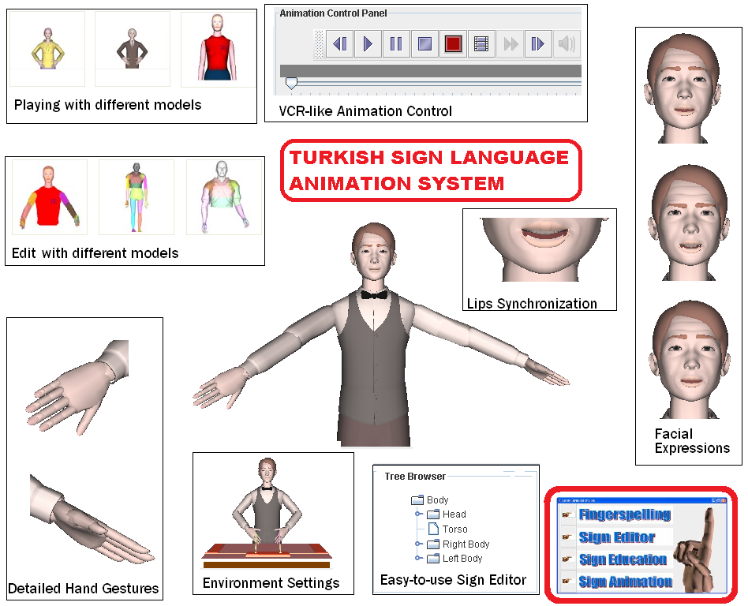
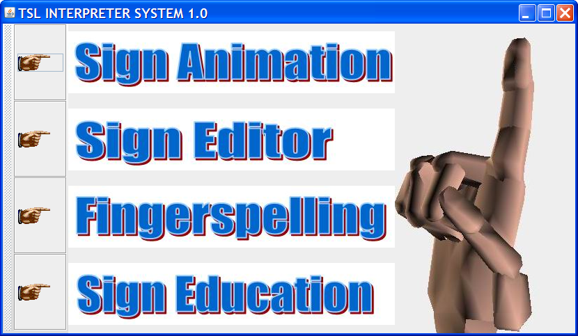

# Turkish Sign Language Animation System
State of the art 3D Sign Language system for Turkish Sign Language

<p>

</p>

## Introduction
This applicaton is intented to use by both natural sign language users and people who want to learn sign language. You can directly convert any turkish sentence into a 3D animation. 


## Issues
Targeted for desktop only.You need to build with necerssarty jar files. All jar files are included.

## Development
This project can be developed further by adding more sign animations. Please feel free to participate.

## Requirements

+ zemberek.jar
+ vrmlto3D.jar
+ Java3D.jar
+ Eclipse

## Modules
Program has different modules. Sign Animation Module is for Sign Language. Education module is targeted for sign language students. Hand module is for hand-only sign language.

<p>

</p>

## Build Setup

``` bash
# install and build

```

# Zemberek - A natural language processor

A full-featured lnaguage processor used. [Unmaintained](https://github.com/ahmetaa/old-zemberek-unmaintained)

# Vrml Loader

A full-featured vrml imported included for 3D models and animations.(http://www.java2s.com/Code/Java/3D/LoadingaVRMLfile.htm)

## Project Structure

* `src/assets` - folder with static assets (images)
* `src/components` - folder with custom java components
* `src/src` - app codes
* `src/library - main library files where you include/import all required libs
## License
MIT
